# Bike Sharing Problem (BoomBikes)

## Problem Statement
A bike-sharing system is a service in which bikes are made available for shared use to individuals on a short term basis for a price or free. Many bike share systems allow people to borrow a bike from a "dock" which is usually computer-controlled wherein the user enters the payment information, and the system unlocks it. This bike can then be returned to another dock belonging to the same system.

A US bike-sharing provider BoomBikes has recently suffered considerable dips in their revenues due to the ongoing Corona pandemic. The company is finding it very difficult to sustain in the current market scenario. So, it has decided to come up with a mindful business plan to be able to accelerate its revenue as soon as the ongoing lockdown comes to an end, and the economy restores to a healthy state. 

In such an attempt, BoomBikes aspires to understand the demand for shared bikes among the people after this ongoing quarantine situation ends across the nation due to Covid-19. They have planned this to prepare themselves to cater to the people's needs once the situation gets better all around and stand out from other service providers and make huge profits.

They have contracted a consulting company to understand the factors on which the demand for these shared bikes depends. Specifically, they want to understand the factors affecting the demand for these shared bikes in the American market. The company wants to know:

1. Which variables are significant in predicting the demand for shared bikes.
2. How well those variables describe the bike demands
3. Based on various meteorological surveys and people's styles, the service provider firm has gathered a large dataset on daily bike demands across the American market  based on some factors. 

## Business Goal
We are required to model the demand for shared bikes with the available independent variables. It will be used by the management to understand how exactly the demands vary with different features. They can accordingly manipulate the business strategy to meet the demand levels and meet the customer's expectations. Further, the model will be a good way for management to understand the demand dynamics of a new market. 

## Table of Contents
* [Basic Info](#Basic-information)
* [Exploratory Data Analysis](#exploratory-data-analysis)
* [Data Preparation](#data-preparation)
* [Model Building](#model-building)
* [Residual Analysis](#residual-analysis)
* [Prediction and Evaluation](#prediction-and-evaluation)
* [Conclusions](#conclusions)


## Basic Information
- General information
    - Dataset is very much clean and there is no missing values. 
    - Dataset is having 15 columns and 730 rows.
    - It has integer, float and object datatype.

- Pre-processing
    - Below columns are dropped
        - 'instant'
        - 'dteday'
        - 'atemp'
    - All the columns are renamed for better understanding.

## Exploratory Data Analysis
- Count vs Weekday
    - On Weekends, the Non-Registered users are very high.
    - On weekdays, the Registered users are high.

    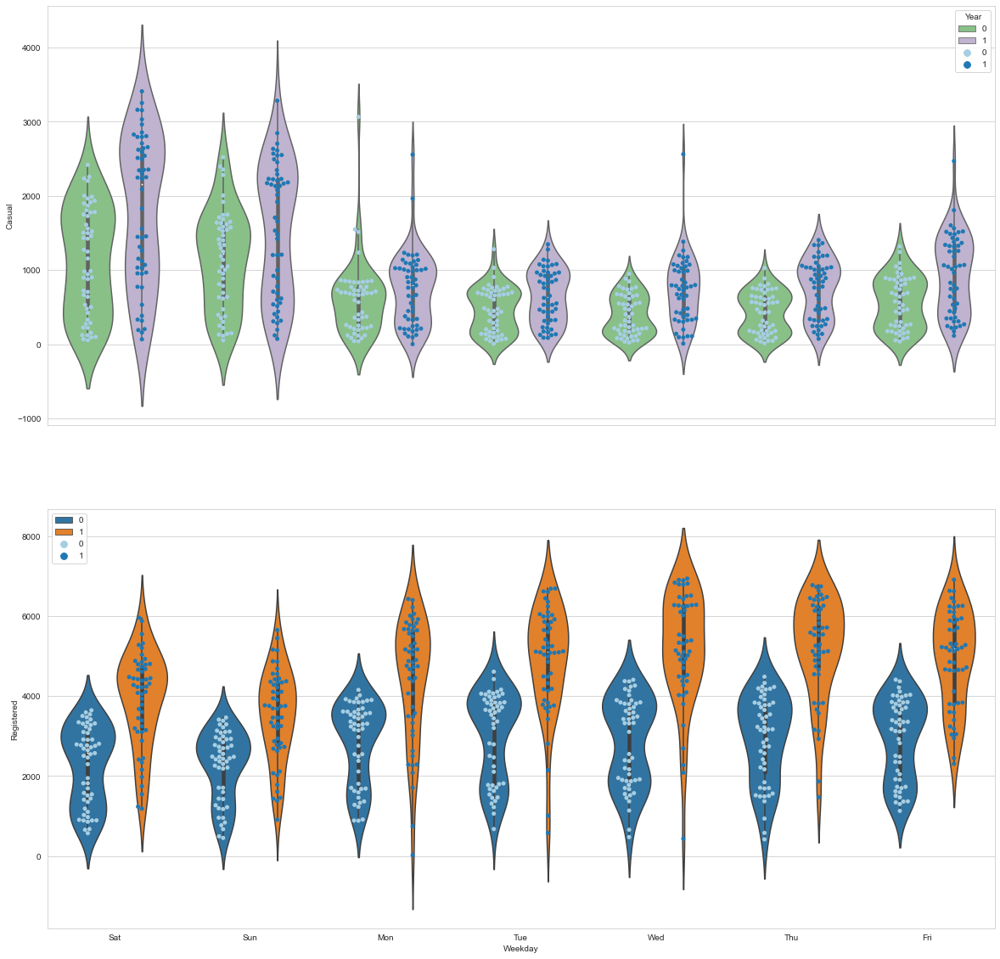

- Count vs Month
    - counts are higher in the middle of the months. Especially in case of Non-Registered users.

    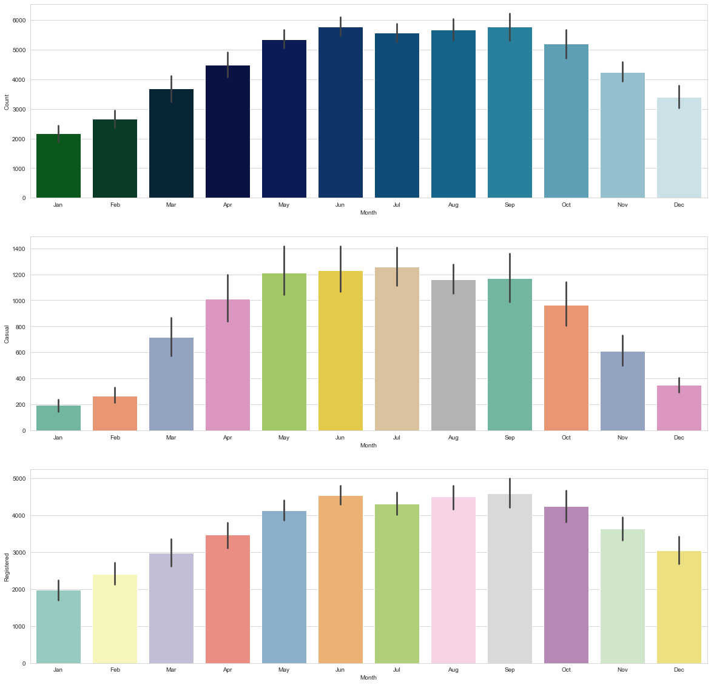

- Count vs Different Seasons
    - Fall Season has the higher no of counts and spring season has the lower no of counts.
    - Counts are very higher in 2019 then 2018.
    - Approx 70% of the data are work days and 30% of the data are leave days(holiday and weekend) but still we can't see much difference. Hence we can say that in a year the proportion of total count for the bike rental is 50-50 for leave days and work days.
    - Only 2.87% of data are represending the holidays. Even with that low number of days we could see that count is higher in fall season (Autumn - Pleasant Environment) compared with weekdays which is the remaining 97% of days in a year.

    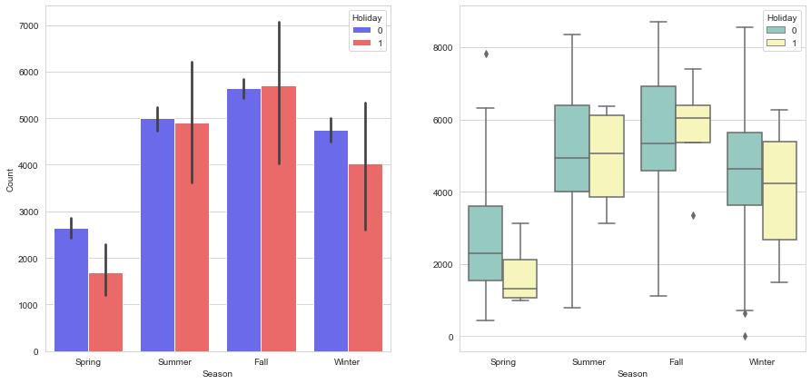

- Count vs Weather
    - Comparatively in 2019, count is higher. Under variour weather conditions Its obvious that in clear weather condition count is higher but still from the above graph and calculation its very clear that the data we hold for clear is higher in comparision with light rain.
    - Once again its proving except in the case of light rain, though holiday is just about 30% and the remaining 70% are working day under Mist and Clear weather condition count is almost similar.
    - Unlike Seasons, Across different weather conditions count is comparetively lower in the holidays but still holidays hold only around 3% of days in a year.

    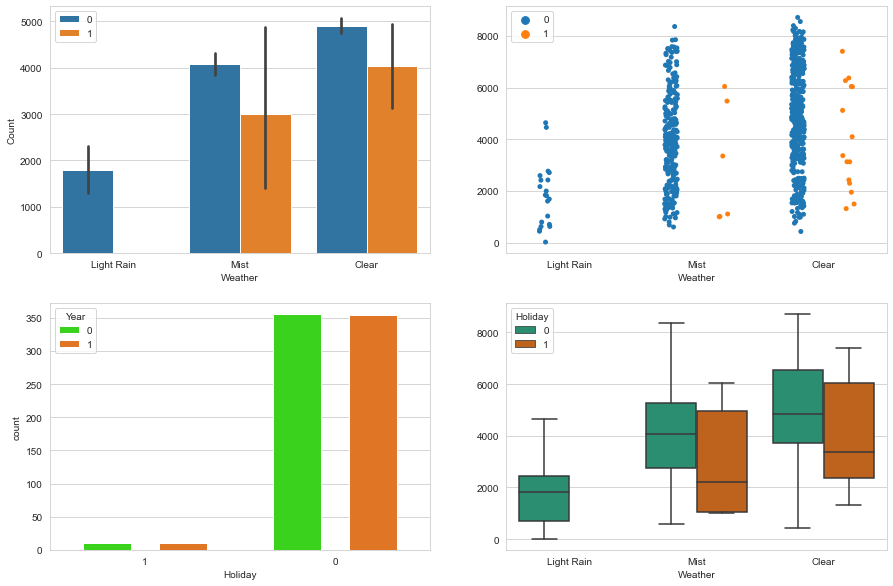
   

- Count vs Temperature, Humidity and Windspeed
    - From the below graphs we can understand that temperature is positively co-related with the count where as humidity is slightly negatively co-related and windspeed is negatively co-related.

    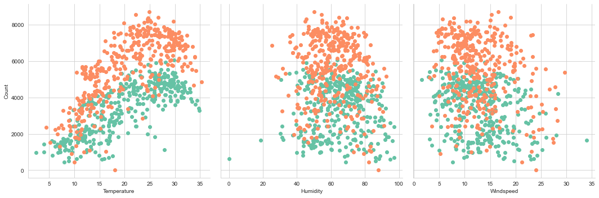


## Data Preparation
- Dropping the below variables as they are not required for modeling.
    - 'Casual'
    - 'Registered'
    - 'Count'

- Creating dummy variables for the below columns
    - 'Season'
    - 'Month'
    - 'Weekday'
    - 'Weather'

- Dropping the below variables as we don't need anymore.
    - Friday is dropped
    - Fall season is dropped
    - Apr is dropped
    - Clear is dropped

- Train Test Split 
    - 70% as training data
    - 30% as test data

- Data Analysis

    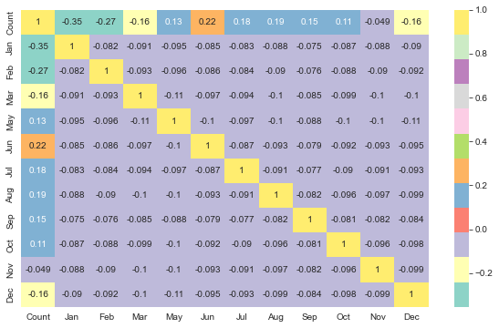
    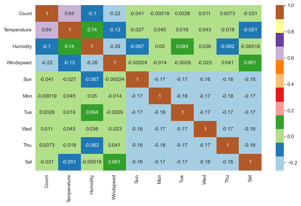
    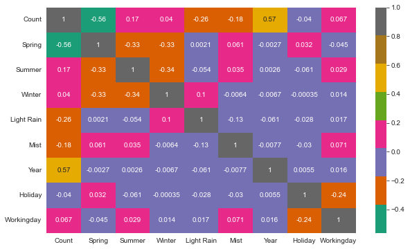

## Model Building 
Several Model building attemps were made and finally came up with good model with all features having very low VIF (less than 5) and very low P-Value(less than 0.05)  

    Count = 0.261(Const) + 0.238(Year) + 0.400(Temp) - 0.153(windspeed) - 0.082(Spring) + 0.037(Summer) + 0.104(Winter) - 0.057(Dec) - 0.050(Jan) + 0.034(Jun) - 0.069(Nov) + 0.059(Sep) - 0.029(Mon) - 0.041(Sun) - 0.272(Light Rain) - 0.078(Mist)

## Residual Analysis
- Verifying whether the error terms are normally distributed

    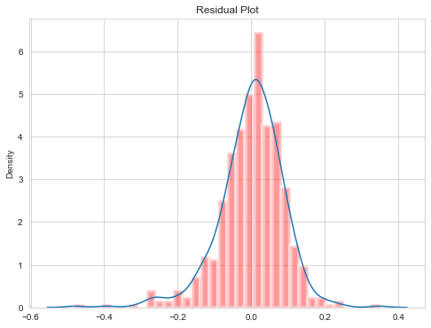

Just like we expected the error terms (residuals) are normally distributed.

- Verifying the error terms having constant variance accross different independent variables and they do not follow any pattern

    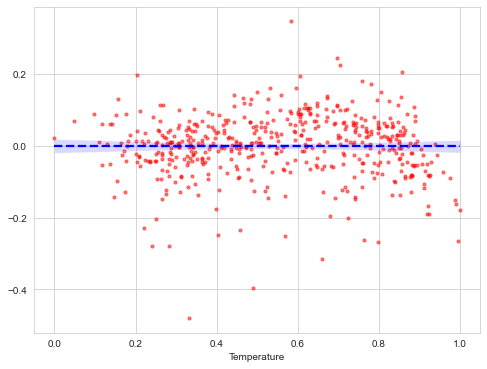
    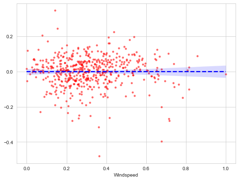
    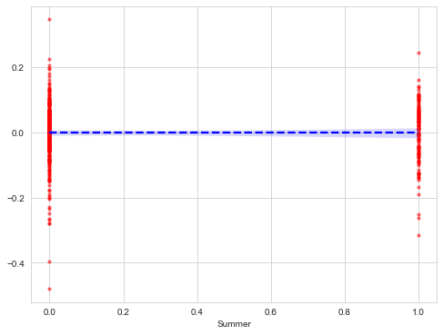
    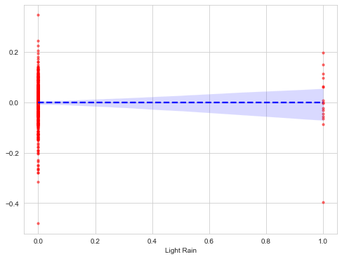
    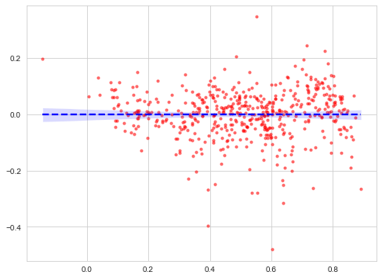

Just like we expected error terms having constant variance and they do not follow any pattern. So lets predict and evalute the model.

## Prediction and Evaluation
Model prediction on the test data set is quite good as that of train data set. Both having more that 80 % R2 Value.

```python 

r2_score(y_true=y_train, y_pred=y_train_pred)
0.8456620899385177

r2_score(y_true=y_test, y_pred=y_test_pred)
0.8047821128977493

```

## Conclusions
- Conclusion 1 from the analysis
- Conclusion 2 from the analysis
- Conclusion 3 from the analysis
- Conclusion 4 from the analy


## Contact
Created by [Vinoth029@githubusername](https://www.linkedin.com/in/vinoth-k-84080b156/)- feel free to contact me!
